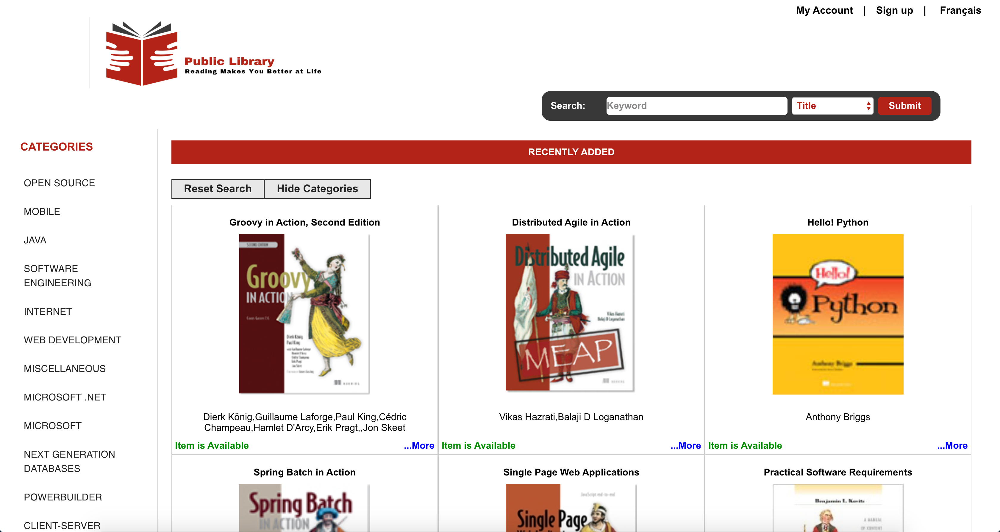
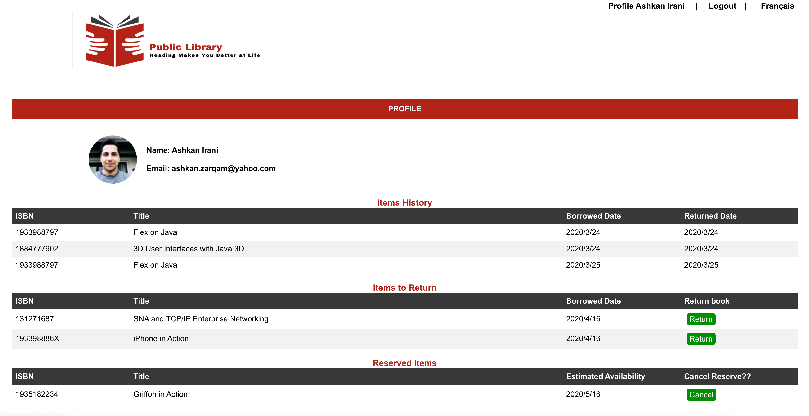

<h1> Public Library </h1>
<h2> Concordia Full-Stack Web Development Bootcamp - Final Project</h2>
<h3>Features: </h3>

 <ul>    
<li>	Built a web app that serves as online reservation for a public library as my Concordia project. </li>
<li>	Built custom search functionality (search across book category, title and description)</li>
<li>	Built email authentication as well Facebook and Google sign-in.</li>
<li>	Used i18next react library to translate in both French and English.</li>
<li>	Building using React Hooks on the frontend, Express on the backend, MongoDB as a data store.</li>
<li>	Used Redux for global state with multiple Reducers.</li>
<li>	Keep track of the active sessions by cookie.</li>
<li>	Google maps, Material UI, Mocha and Chai, Mongo Seeder.</li>
<li>	Responsive design.</li>
 </ul>
   
<h3>Highlights: </h3>
 <ul>  
   <li> JavaScript</li>
   <li> React</li>
   <li> Hooks</li>
   <li> Redux / Redux Immer</li>
   <li> JavaScript Extension (JSX) </li>
   <li> NodeJS </li>
   <li> Express </li>
   <li> Google login, Google maps and Facebook login</li> 
   <li> MongoDB</li>
   <li> SuperTest, Mongo Seeding, Mocha, Chai </li>
   <li> I18n</li>
 </ul>
   
<h3>Live: </h3>
   
https://warm-badlands-14489.herokuapp.com/

<h3>Demo: </h3>
   
https://www.youtube.com/watch?v=2cNZauDhCRA&t=28s 

